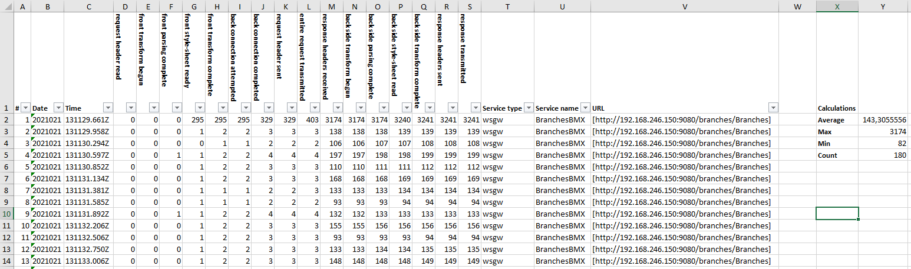
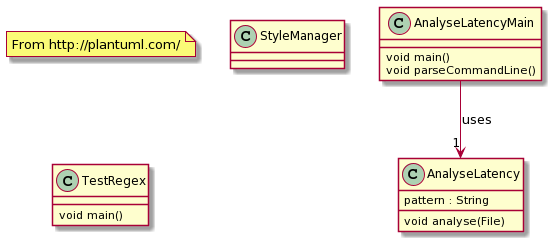

Simple Java application to parse DataPower log and generates an Excel spreadsheet. 
Latency information is parsed, then re-ordered. The excel spreadsheet allows you to rework and filter the data.
If too many records then only a csv is generated.

For background information, please look at the following articles:
* [Official documentation on DataPower V10](https://www.ibm.com/support/knowledgecenter/SS9H2Y_10.0/com.ibm.dp.doc/latency_messages.html)
* [An explanation on latency messages in DataPower appliance ](https://www.ibm.com/support/pages/latency-messages-datapower-appliance)
* [Article from Paul Gletzen](http://pglezen.github.io/dpShowLatency/ShowLatency.html)

The Java application is very simple. It is made of 4 classes. 2 are not important.
The class diagramm below show the classes with main information

| Class              | Role                                                                                                                                                                                                                                   |
|--------------------|----------------------------------------------------------------------------------------------------------------------------------------------------------------------------------------------------------------------------------------|
| AnalyseLatencyMain | The main class. It validates the arguments. It instantiates the AnalyseLatency class.                                                                                                                                                  |
| AnalyseLatency     | The class that does the job. It creates the Excel spreadsheet. Parses, based on a big regex, each line of the log. And add the right values in each column.                                                                            |
| StyleManager       | Not used                                                                                                                                                                                                                               |
| TestRegex          | The one important part of this program beside the handling of Excel is the parsing of the log. I use a big regex to do so. This class is used to validate that the regex still works. It is independant of the two main classes.       |

The only difficulty with this programm are the librairies used to manipulate Excel spreadsheet. The easiest way is to copy the one I'm using in your env.

For information, the latency information are very good to identify if the performance problem happens in front of dataPower, or inside DataPower or on the back end (most of time this is the last one where most the problem occur...).
If you find out that the problem is indeed inside DataPower in the processing itself, there is another log called extended latency that will provide even more insight on what is going on inside DataPower. I do not have not written a parser for it, but a similar way can be used to handle it.

Final word: This tool is used for adhoc troubleshooting. It is not industrial. Another to handle this is to use the Latency log and send them to elastic stack with kafka for example and then use Kibana to filter the data as wishes.